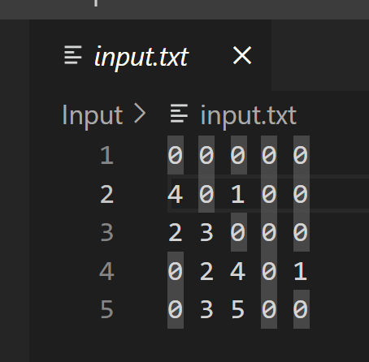
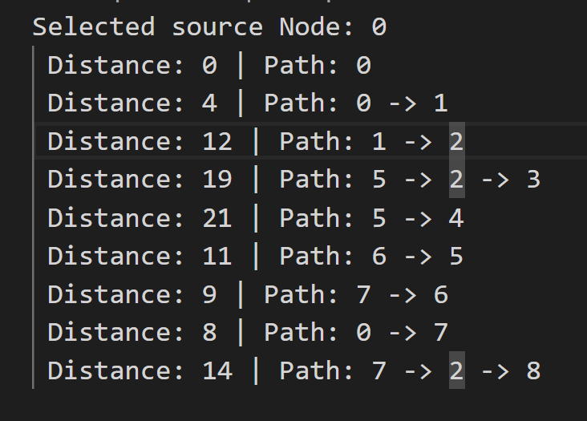
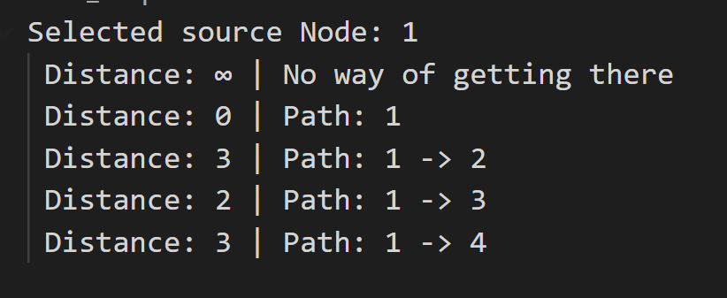

# Dijkstra's Shortest Path Algorithm

## Running the code
```c#
// FileName, NodesAmount, SourceNode
dotnet run TestMatrix.txt 5 0
```

Running it without any information will automatically add this: TestMatrix.txt as the input file, 5 nodes and 0 as the source node. If at least 3 arguments are found, they will be taken as consideration for the used file name, the nodes amount and the selected Node.

### Must have
No extra packages need to be installed, other than .NET 6, which is used for the project.

## Input Data
The input expected data is an adjacency matrix that represents a weighted directed graph where the connected nodes have a weight, an the not connected nodes have 0 as data.

Here is a screenshot on how  the input data looks like. You can also find the text file in the Input Folder.


## Output
The output will be all of the paths to the different nodes based on the provided node source.


Whenever there is no way to reach the path, infinity will appear.


## Conditions
To make the solution work, either correct input or no input should be given. A wrong path to the input file, wrong adjacency matrix (like, for example, with unknown characters), an incorrect number of given nodes or an inexisten source node will lead to an execution error, or wrong result. 

